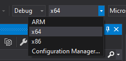

# Building from sources (Windows)

The MixedReality-WebRTC libraries for Windows platforms (Desktop and UWP) are built from the `Microsoft.MixedReality.WebRTC.sln` Visual Studio solution located at the root of the git repository.

## Prerequisites

### Environment and tooling

- The NuGet packages for the input dependencies (see _Core input dependencies_ below) require in total approximately **10 GB of disk space**. Those dependencies contain unstripped `.lib` files much larger than the final compiled DLL libraries, for both the Debug and Release build configurations.

- Due to Windows paths length limit, it is recommended to **clone the source repository close to the root** of the filesystem, _e.g._ `C:\mr-webrtc\` or similar, as the recursive external dependencies create a deep hierarchy which may otherwise produce paths beyond the OS limit and result in build failure.

- The solution uses **Visual Studio 2019** with the following features:

  - The **MSVC v141 - VS 2017 C++ x64/x86 build tools** toolchain from Visual Studio **2017** is required to build the C++17 library of MixedReality-WebRTC. This will eventually be replaced with the Visual Studio **2019** compiler (v142 toolchain) once the project is upgraded to a Google milestone supporting Visual Studio 2019 (see details on [issue #14](https://github.com/microsoft/MixedReality-WebRTC/issues/14))

  - For ARM support, the **MSVC v141 - VS 2017 C++ ARM build tools** toolchain is also required.

  - The C# library requires a .NET Standard 2.0 compiler, like the Roslyn compiler available as part of Visual Studio when installing the **.NET desktop development** workload.

  - The UWP libraries and projects require UWP support from the compiler, available as part of Visual Studio when installing the **Universal Windows Platform development** workload.

- The Unity library is officially supported for [Unity](https://unity3d.com/get-unity/download) version **2018.4.x** (LTS) and **2019.4.x** (LTS). However, we do our best to keep things working on other versions too where possible. Versions earlier than 2018.4.x may work but are not tested at all, and no support will be provided for those.

### Core input dependencies

The so-called _Core_ input dependencies are constituted of:

- `webrtc.lib` : A static library containing the Google implementation of the WebRTC standard.
- `Org.WebRtc.winmd` : A set of WinRT wrappers for accessing the WebRTC API from UWP.

Those dependencies require many extra prerequisites. They are also complex and time-consuming to build. Therefore to save time and avoid headache the MixedReality-WebRTC solution consumes those dependencies as precompiled NuGet packages [available from nuget.org](https://www.nuget.org/packages?q=Microsoft.MixedReality.WebRTC.Native.Core). Those NuGet packages are compiled from [the WebRTC UWP project](https://github.com/webrtc-uwp/webrtc-uwp-sdk) maintained by Microsoft. So **there is no extra setup for those**.

## Cloning the repository

The official repository containing the source code of MixedReality-WebRTC is [hosted on GitHub](https://github.com/microsoft/MixedReality-WebRTC). The latest developments are done on the `master` branch, while the latest stable release is a `release/*` branch.

Clone the choosen branch of the repository and its dependencies **recursively**, preferably close to the root of the filesystem (see prerequisites):

```cmd
git clone --recursive https://github.com/microsoft/MixedReality-WebRTC.git -b <branch_name> C:\mr-webrtc
```

Note that **this may take some time (> 5 minutes)** due to the large number of submodules in [the WebRTC UWP SDK repository](https://github.com/webrtc-uwp/webrtc-uwp-sdk) this repository depends on.

## Building the libraries

1. Open the `Microsoft.MixedReality.WebRTC.sln` Visual Studio solution located at the root of the freshly cloned repository.

2. Select the build variant with the Solution Configuration selector at the top of the window under the main menu.

   

   - Choose the build configuration (`Debug` or `Release`); generally it is recommended to always use the `Release` configuration, as the `Debug` configuration of the underlying `webrtc.lib` implementation used by the native C library can be notably slow in `Debug`.
   - Choose the build architecture corresponding to the variant needed:
     - `x86` for the 32-bit Windows Desktop and UWP variants
     - `x64` for the 64-bit Windows Desktop and UWP variants; this includes the x64 Desktop variant required by the Unity editor
     - `ARM` for the 32-bit Windows UWP ARM variant

3. Build the solution with F7 or **Build > Build Solution**

On successful build, the binaries will be generated in a sub-directory under `bin/`, and the relevant DLLs will be copied by a post-build script to `libs\unity\library\Runtime\Plugins\` for the Unity library to consume them.

> [!IMPORTANT]
> **Be sure to build the solution before importing the Unity library package into any Unity project.** As part of the build, the libraries are copied to the `Plugins` folder of the Unity library. There are already some associated `.meta` files, which have been committed to the git repository, to inform Unity of the platform of each DLL and how to deploy it. If the Unity project is opened first, before the DLLs are present, Unity will assume those `.meta` files are stale and will delete them, and then later will recreate some with a different default config once the DLLs are copied. This leads to errors about modules with duplicate names. See the [Importing MixedReality-WebRTC](unity/helloworld-unity-importwebrtc.md) chapter of the "Hello, Unity World!" tutorial for more details.

## Testing the build

Test the newly built libraries by _e.g._ running some of the Windows Desktop tests:

1. Build the `mrwebrtc-win32-tests` after selecting a Solution Configuration including the `x86` or `x64` architecture.

2. Run it by right-clicking on the project and selecting **Debug** > **Start New Instance** (or F5 if the project is configured as the Startup Project). Alternatively, the test program uses Google Test and integrates with the Visual Studio Test Explorer, so tests can be run from that panel too.

----

_Next_ : [Building the C# library](building-cslib.md)
