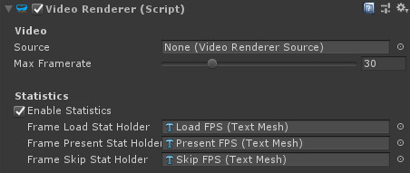

# Unity `VideoRenderer` component

The [`VideoRenderer`](xref:Microsoft.MixedReality.WebRTC.Unity.VideoRenderer) Unity component is a utility component to render some video frames into a Unity texture.

| Property | Description |
|---|---|
| **Video** | |
| Source | Reference to the [`VideoRendererSource`](xref:Microsoft.MixedReality.WebRTC.Unity.VideoRendererSource) instance that the components acquires the video frames from. Only instances of classes implementing the [`IVideoSource`](xref:Microsoft.MixedReality.WebRTC.Unity.IVideoSource) interface are valid. Both [`VideoTrackSource`](xref:Microsoft.MixedReality.WebRTC.Unity.VideoTrackSource) (local video) and [`VideoReceiver`](xref:Microsoft.MixedReality.WebRTC.Unity.VideoReceiver) (remote video) can be assigned. |
| MaxFramerate | Maximum number of video frames per second rendered. Extra frames coming from the video renderer source are discarded. |
| **Statistics** | |
| EnableStatistics | Enable the collecting of video statistics by the media player. This adds some minor overhead. |
| FrameLoadStatHolder | Reference to a [`TextMesh`](https://docs.unity3d.com/ScriptReference/TextMesh.html) instance whose text is set to the number of incoming video frames per second pulled from the video source into the media player's internal queue. |
| FramePresentStatHolder | Reference to a [`TextMesh`](https://docs.unity3d.com/ScriptReference/TextMesh.html) instance whose text is set to the number of video frames per second dequeued from the media player's internal queue and rendered to the texture(s) of the [`Renderer`](https://docs.unity3d.com/ScriptReference/Renderer.html) component associated with this media player. |
| FrameSkipStatHolder | Reference to a [`TextMesh`](https://docs.unity3d.com/ScriptReference/TextMesh.html) instance whose text is set to the number of video frames per second dropped due to the media player's internal queue being full. This corresponds to frames being enqueued faster than they are dequeued, which happens when the source is overflowing the sink, and the sink cannot render all frames. |
